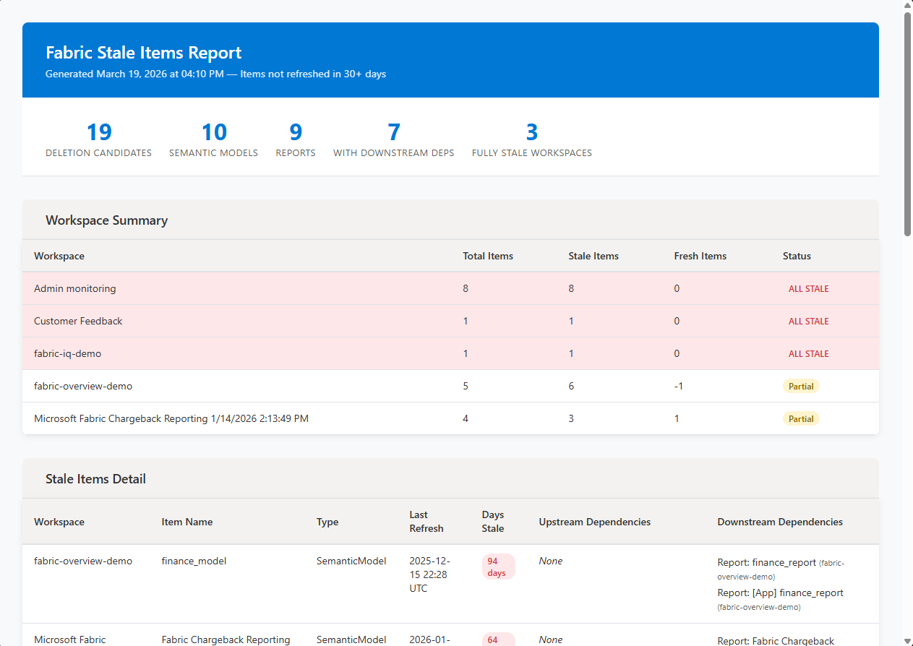

# Fabric Stale Items Scanner

Scans all reports and semantic models across your Microsoft Fabric or Power BI tenant, identifies items that haven't been refreshed in 30+ days, maps their upstream and downstream dependencies, and generates a styled HTML report.

> **Note:** This scanner only assesses **semantic models** and **reports**. Other workspace items (lakehouses, notebooks, dataflows, pipelines, warehouses, etc.) are not evaluated.

## Sample Report



## What It Does

1. **Lists all workspaces** the authenticated user has access to via the Power BI REST API.
2. **Enumerates semantic models and reports** in each workspace.
3. **Checks refresh history** for each semantic model using the Power BI REST API. Reports inherit staleness from their underlying semantic model.
4. **Flags deletion candidates** — any item whose last refresh is older than 30 days (configurable via `$StaleThresholdDays`).
5. **Resolves dependencies** using the Power BI Admin Scanner API to find upstream sources and downstream consumers for each stale item.
6. **Generates an HTML report** with:
   - A **Workspace Summary** table showing which workspaces contain only stale semantic models/reports (highlighted as "ALL STALE") vs. a mix of stale and fresh items. Workspaces may contain other item types not reflected in this summary.
   - A **Stale Items Detail** table listing every deletion candidate with its last refresh date, days stale, and dependency information.

## Requirements

| Prerequisite | Install |
|-------------|---------|
| `Az.Accounts` module | `Install-Module Az.Accounts -Scope CurrentUser` |

The script produces a `fabric_stale_items_report.html` output file.

## Permissions Required

### Azure AD / Entra ID
- An Azure AD account that can authenticate via `Connect-AzAccount` (PowerShell) or `InteractiveBrowserCredential` (Python).

### Power BI / Fabric API Permissions
| Permission | Why |
|------------|-----|
| **Workspace read access** | List workspaces and their items (`/v1/workspaces`) |
| **Dataset.Read.All** | Read semantic models and their refresh history |
| **Report.Read.All** | List reports in each workspace |
| **Tenant.Read.All** or **Fabric Admin** role | Required for the Admin Scanner API (`/admin/workspaces/getInfo`) which provides lineage/dependency data |

> **Note:** If you don't have Fabric Admin permissions, the script will still identify stale items — it just won't be able to resolve upstream/downstream dependencies.

### Minimum Role
- **Fabric Administrator** or **Power BI Service Administrator** for full lineage scanning.
- **Workspace Viewer/Member** across target workspaces for basic stale-item detection without lineage.

## Usage

### PowerShell
```powershell
# Install prerequisite (one-time)
Install-Module Az.Accounts -Scope CurrentUser

# Run the scanner
.\FabricStaleItemScanner.ps1
```

## Configuration

Edit the variables at the top of either script:

| Variable | Default | Description |
|----------|---------|-------------|
| `StaleThresholdDays` / `STALE_THRESHOLD_DAYS` | `30` | Number of days without a refresh before an item is flagged |
| `OutputFile` / `OUTPUT_FILE` | `fabric_stale_items_report.html` | Path for the generated report |
